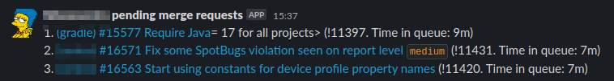

# marge-bot-slack-tool

A tool for posting the current merge requests waiting to be merged by
[Marge-bot](https://github.com/smarkets/marge-bot) to a Slack channel. (Note
that we use this ourselves with [our fork of
Marge-bot](https://github.com/hiboxsystems/marge-bot), but there should be
nothing preventing it from being used with the upstream Marge-bot version if
needed)

The tool has been tested with on-premise installations of GitLab only, but could
theoretically work for GitLab SaaS (i.e. gitlab.com) as well.

## Screenshot

When the tool is running and you have three merge requests in the queue, it can
look like this:



## Local development

The project is written on Python and has been tested with version 3.9. To
install the `pip` dependencies from `requirements.txt`, use `pip install`.

There are also local environment variables that need to be set to be able to run the script locally.
The preferred way of doing this requires the following tooling:

* [`direnv`](https://direnv.net/) (`sudo apt-get install direnv`)

With this in place, `direnv` should set up the environment variables whenever
you `cd` to the project directory. You can also set the environment variables
using some other means; just set all the variables mentioned in
[`.envrc`](.envrc) in that case.

You can then execute the script like this:

```shell
$ # The DEBUG flag makes the script be more verbose, logging HTTP requests to stdout/stderr
$ DEBUG=true ./marge_bot_queue_poster.py
```

## Deployment

The normal way to run this would be to clone the `marge-bot-slack-tool` to your GitLab server (for on-premise installations):

```shell
$ ssh <some-server>
$ sudo su <some-user>
$ git clone https://github.com/hiboxsystems/marge-bot-slack-tool.git
$ # Add environment variables above to to ~/.bashrc and customize to match your setup
```

Add all the following (mandatory) environment variables to `.bashrc` (presuming
Bash is being used for the user in question, which is the default on most Linux
distributions):

```shell
export MARGEBOT_PROJECT_IDS=1,2,3,4,5
export MARGEBOT_GITLAB_URL=https://gitlab.example.com
export MARGEBOT_GITLAB_TOKEN=top-secret-token
export MARGEBOT_HELPER_SLACK_WEBHOOK_URL=https://hooks.slack.com/path/to/webhook
export MARGEBOT_HELPER_SLACK_CHANNEL='#some-slack-channel'
export MARGEBOT_HELPER_STATE_FILE_PATH_PREFIX=/path/to/marge-bot-slack-tool/gitlab-marge-bot-helper/local/state
```


Add a `crontab` entry for the `<some-user>` account, to run the tool
periodically (once every minute with the settings below). Note that the manual
sourcing of `~/.bashrc` is critical, to make the environment variables available
to the process.

```cron
SHELL=/bin/bash

# m h  dom mon dow   command
* * * * * . ~/.bashrc && /path/to/marge-bot-slack-tool/marge_bot_queue_poster.py >&1 | logger -t marge-bot-slack-tool
```

If all goes well, you should now be receiving messages in `#some-slack-channel`
whenever there are two merge requests or more pending in the queue.

## License

[BSD 3-clause](LICENSE)

The files in [marge](marge) are copied from
https://github.com/smarkets/marge-bot with minimal changes. These files are
Copyright 2017 Smarkets Limited and are licensed under the same terms as this
tool (except for the Copyright notice).
